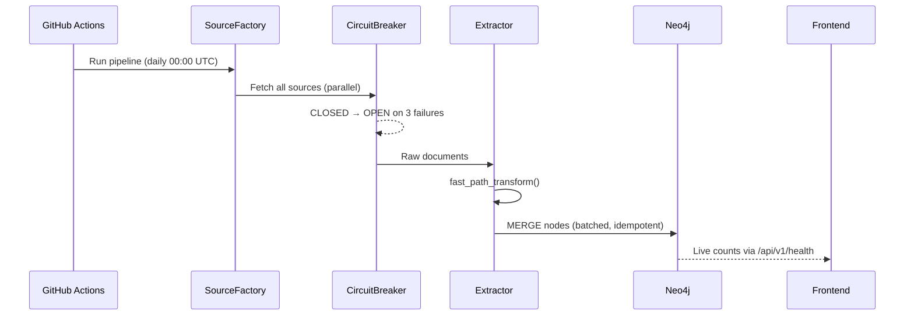
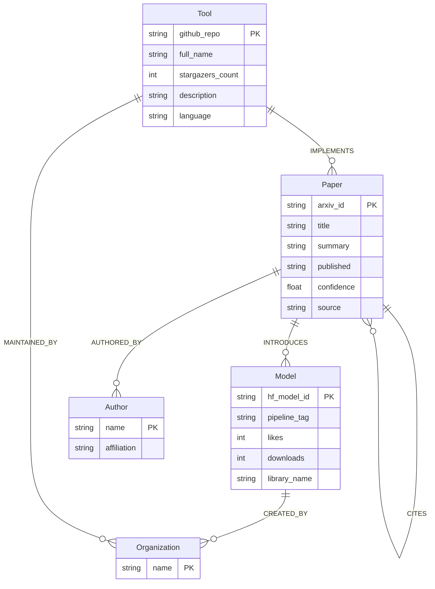
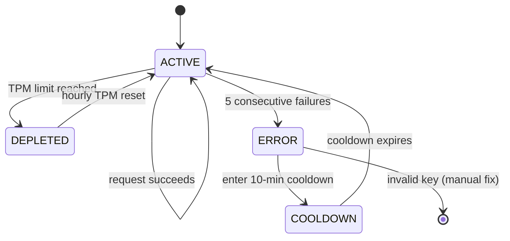
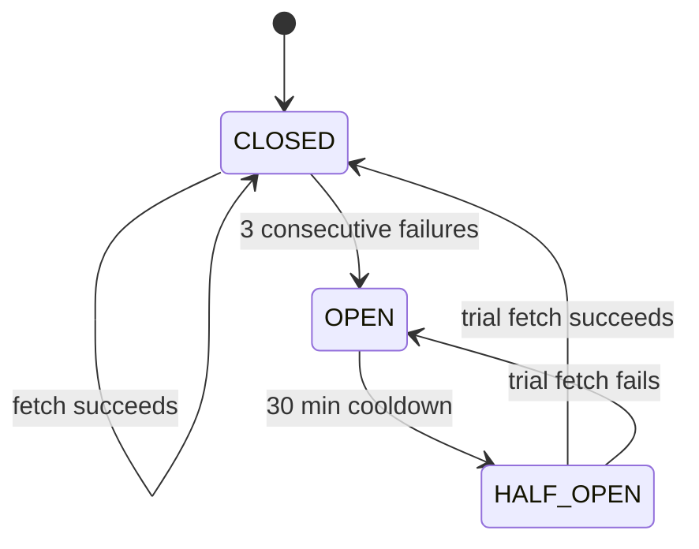

# SYNAPSE v4.0.0

**Systematic, Networked, Yet Natural, Automated, Provenance-aware Schema Engine**

A live, enterprise-grade AI knowledge graph and dynamic reasoning platform. Every relationship carries its source, confidence score, and evidence snippet — updated continuously with high-performance ingestion, custom budget-gated LangGraph reasoning pipelines, and zero-latency retrieval engines.

No login required. Fully open-access.

---

## Architecture

```mermaid
%%{init: {'theme': 'base', 'themeVariables': {'primaryColor': '#e0e7ff', 'primaryTextColor': '#1e1b4b', 'primaryBorderColor': '#6366f1', 'lineColor': '#6366f1', 'secondaryColor': '#f0fdf4', 'tertiaryColor': '#f0f9ff', 'background': '#ffffff', 'mainBkg': '#ffffff', 'nodeBorder': '#6366f1', 'clusterBkg': '#f8fafc', 'clusterBorder': '#e2e8f0', 'titleColor': '#1e1b4b', 'edgeLabelBackground': '#ffffff'}}}%%
flowchart TD
    subgraph Sources["Data Sources (9 APIs)"]
        A1[arXiv]
        A2[HuggingFace Hub]
        A3[GitHub Search]
        A4[Semantic Scholar]
        A5[Papers With Code]
        A6[DAIR.AI]
        A7[OpenAlex]
        A8[HF Daily Papers]
        A9[Kaggle]
    end

    subgraph Pipeline["Ingestion Pipeline"]
        B1[Generic Source Fetcher]
        B2[Circuit Breaker]
        B3[Fast-Path Extraction]
        B4[Neo4j MERGE Writer]
    end

    subgraph Storage["Storage Layer"]
        C1[(Neo4j Aura)]
        C2[(Qdrant Cloud)]
        C3[(PostgreSQL)]
    end

    subgraph Reason["Reasoning Engine (LangGraph)"]
        R1[Decomposition Node]
        R2[Retrieval Node]
        R3[Analysis Crew]
        R4[Contradiction Detector]
        R5[Synthesis & Critic]
    end

    subgraph API["API Layer — FastAPI"]
        D1["GET /health"]
        D2["GET /search"]
        D3["POST /query"]
        D4["GET /export"]
    end

    subgraph Frontend["Frontend — React 19"]
        E1[Dashboard]
        E2[Search]
        E3[Ask SYNAPSE]
        E4[Graph Explorer]
    end

    Sources --> B1
    B1 --> B2
    B2 --> B3
    B3 --> B4
    B4 --> C1
    B4 --> C2
    B4 --> C3
    
    C1 --> Reason
    C2 --> Reason
    
    Reason --> API
    API --> Frontend

    classDef sourceNode fill:#e0e7ff,stroke:#6366f1,color:#3730a3
    classDef pipeNode fill:#f0fdf4,stroke:#22c55e,color:#15803d
    classDef storeNode fill:#f0f9ff,stroke:#0ea5e9,color:#0369a1
    classDef apiNode fill:#faf5ff,stroke:#a855f7,color:#7e22ce
    classDef feNode fill:#fff1f2,stroke:#f43f5e,color:#be123c
    classDef reasonNode fill:#fffbeb,stroke:#d97706,color:#78350f

    class A1,A2,A3,A4,A5,A6,A7,A8,A9 sourceNode
    class B1,B2,B3,B4 pipeNode
    class C1,C2,C3 storeNode
    class D1,D2,D3,D4 apiNode
    class E1,E2,E3,E4 feNode
    class R1,R2,R3,R4,R5 reasonNode
```



---

## Data Flow



---

## Node Schema



---

## Groq Key Rotation



---

## Circuit Breaker



---

## Quick Start

### Prerequisites

*   Python 3.12+ with [uv](https://docs.astral.sh/uv/)
*   Node.js 18+
*   [Neo4j Aura Free](https://neo4j.com/cloud/aura-free/) or local instance
*   [Qdrant Cloud Free](https://qdrant.tech/) or local instance
*   [Groq API keys](https://console.groq.com/) (free tier supported)

### Setup

```bash
# 1. Clone
git clone https://github.com/your-org/synapse.git
cd synapse

# 2. Configure environment
cp .env.example .env
# Fill in: NEO4J_URI, NEO4J_USERNAME, NEO4J_PASSWORD, QDRANT_URL, GROQ_API_KEYS, etc.

# 3. Install dependencies
uv sync --extra dev

# 4. Fix WSL DNS (WSL only — run once per WSL restart)
sudo bash -c "echo 'nameserver 8.8.8.8' > /mnt/wsl/resolv.conf"

# 5. Initialize Neo4j schema
uv run python -m schema.setup

# 6. Run ingestion pipeline (seeds the graph)
uv run python -m ingestion.pipeline.run --domain ai

# Terminal 1 — Backend API
uv run uvicorn api.main:app --host 0.0.0.0 --port 8082 --reload

# Terminal 2 — Frontend
cd frontend && npm install && npm run dev
```

### Access

| Service | URL |
|---------|-----|
| Frontend | `http://localhost:5173` |
| Backend API | `http://localhost:8082` |
| API Docs | `http://localhost:8082/docs` |
| Health | `http://localhost:8082/api/v1/health` |

---

## Environment Variables

### Required

```bash
# Neo4j Graph DB
NEO4J_URI=neo4j+s://xxxxxxxx.databases.neo4j.io
NEO4J_USERNAME=neo4j
NEO4J_PASSWORD=your-password
NEO4J_DATABASE=neo4j

# Groq — comma-separated for multi-key rotation and token limits
GROQ_API_KEYS=gsk_key1,gsk_key2,gsk_key3
```

### Optional

```bash
GITHUB_TOKEN=ghp_xxx          # Raises GitHub rate limit 60 → 5000 req/hr
POSTGRES_URL=postgresql://... # Persistent ingestion checkpointing (Neon.dev/local)
QDRANT_URL=https://...        # Semantic vector database (Qdrant Cloud)
QDRANT_API_KEY=xxx
GEMINI_API_KEY=xxx            # Multimodal PDF extraction fallbacks
LOG_LEVEL=INFO
CORS_ORIGINS=http://localhost:5173
```

---

## Running the Ingestion Pipeline

```bash
# All sources in AI domain
uv run python -m ingestion.pipeline.run --domain ai

# Specific sources only
uv run python -m ingestion.pipeline.run --domain ai --sources huggingface_trending_models,github_repo_content

# Available sources:
# arxiv, huggingface_daily_papers, huggingface_trending_models,
# huggingface_hub, papers_with_code, github_trending,
# github_repo_content, semantic_scholar, dair_ai_ml_papers
```

---

## Adding a New Data Source

No Python code required. Simply add an entry to `domains/ai/sources.yaml`:

```yaml
- name: my_source
  type: rest_json          # rest_json | rest_xml | rss | github_rss
  base_url: https://api.example.com/papers
  auth_required: false
  entity_coverage:
    - Paper
    - Author
  fetch_params:
    limit: 100
    sort: created_at
```

Or utilize the interactive AI-powered generator:

```bash
uv run python scripts/source_config_generator.py
```

---

## API Reference

All endpoints are open access — no authentication required.

| Method | Endpoint | Description |
|--------|----------|-------------|
| `GET` | `/api/v1/health` | Live node/edge counts + system status |
| `GET` | `/api/v1/search?q=&type=&cursor=` | Full-text + semantic vector hybrid search |
| `POST` | `/api/v1/query` | Natural language → Cypher / RAG Query |
| `GET` | `/api/v1/similar?id=&k=5` | Semantic similarity via Qdrant |
| `GET` | `/api/v1/export?query=&format=` | Subgraph export (JSON-LD / CSV / GraphML) |
| `GET` | `/api/v1/whats-new?days=1` | New entities added in the last N days |
| `GET` | `/api/v1/diff?from=&to=` | Temporal diff between two snapshots |
| `GET` | `/api/v1/leaderboard?type=tools` | Leaderboards of highly cited/starred assets |
| `GET` | `/api/v1/groq/status` | Groq key rotation and quota status |

---

## Evaluation Metrics

| Metric | Target | Description |
|--------|--------|-------------|
| `precision@5` (T1/T2) | > 0.85 | Retrieval relevance precision |
| `recall@20` | > 0.75 | Coverage of key facts in retrieval |
| `edge correctness` | > 0.80 | Graph relationship extraction correctness |
| `freshness lag` | < 30 hours | Max latency from source publish to graph writer |
| `NL hallucination rate`| < 0.05 | Maximum rate of LLM hallucination on queries |
| `semantic recall` | > 0.80 | Context matching via SentenceTransformers |
| `circuit recovery rate` | > 0.90 | Self-healing rate of pipeline breakers |

---

## Frontend Pages

| Route | Page | Description |
|-------|------|-------------|
| `/` | Dashboard | Live counts, animated trackers, source status tickers |
| `/search` | Search | Multi-mode (Full-text + Semantic vector) dynamic filters |
| `/ask` | Ask SYNAPSE | Multi-agent reasoning chat (LangGraph native) |
| `/graph` | Graph Explorer | Sigma.js WebGL interactive 2D graph viewer |
| `/diff` | What Changed | Temporal analysis of changes between ingestion runs |
| `/leaderboard` | Leaderboards | Highly active tools, papers, frameworks, and techniques |
| `/quality` | Quality | Real-time SLA monitoring and Ragas evaluation e2e metrics |
| `/export` | Export | Subgraph downloader (JSON-LD, CSV, GraphML) |

---

## Architecture Evolution

| Component | v2.0 (NEXUS) | v3.0 (SYNAPSE) | v4.0.0 (Current SYNAPSE Enterprise) |
|-----------|--------------|----------------|-------------------------------------|
| **Multi-agent Reasoning** | CrewAI Flows | LangGraph Native | **LangGraph with Dynamic Token/Cost Budget Gates** |
| **Embedding Engine** | Unspecified | all-MiniLM-L6-v2 | **Thread-safe SentenceTransformer Singleton (Zero-Latency)** |
| **Budget Control** | None | DynamoDB Budget Oracle | **Transactional Auto-Rollback Scheduler + Fallback DynamoDB Logging** |
| **API & Rate Limiting** | Unversioned | `/api/v1/` with static limits | **Client IP rate limiter with automated 5-min eviction sweeps** |
| **Retrieval Engine** | Database-bound | Qdrant / Neo4j separately | **Integrated Hybrid Vector + BM25 + Graph with query fallbacks** |
| **Checkpointing** | SQLite (ephemeral) | PostgreSQL via Neon.dev | **Persistent PostgreSQL with transactional consistency** |
| **Data Sources** | 9 | 11 | **11 Universal domain-agnostic YAML-configured sources** |

---

## Design Patterns Applied

| Pattern | Component | Benefit in SYNAPSE |
|---------|-----------|--------------------|
| **Singleton** | `embedding/generator.py` | Prevents reloading SentenceTransformer parameters on every query (80%+ latency reduction). |
| **Circuit Breaker** | `ingestion/circuit_breaker.py` | Wraps API streams. Automatically suspends queries to down APIs, auto-recovers after cooling. |
| **Strategy** | `ingestion/pipeline/extraction.py` | SWAP custom model pipelines or regex extractions depending on source schema constraints. |
| **Factory** | `ingestion/source_factory.py` | Dynamically instantiates REST/RSS fetchers using domain-agnostic declarative YAML configurations. |
| **Observer / PubSub**| `webhook/dispatcher.py` | Signs payloads and broadcasts real-time ingestion completions to external developer webhooks. |
| **Decorator** | `reasoning/graph/builder.py` | Transparently injects cost validation and rate limits onto graph processing steps. |
| **Command** | `admin/review_queue.py` | Supports audit logs and interactive undo/redo execution of administrative graph edits. |

---

## Project Structure

```
synapse/
├── api/                        # FastAPI Gateway
│   ├── main.py                 # Core API application, lifespan and middleware routing
│   ├── middleware.py           # Rate limiting with 5-minute cleanup sweep, security, and CORS
│   ├── groq_manager.py         # Multi-key Groq rate/quota limiting manager
│   ├── query.py                # NL query parsing controllers
│   └── v1/
│       ├── router.py           # Core endpoints (search, health, diff, similar, export)
│       ├── groq_status.py      # Groq key telemetry and rotators
│       └── reasoning.py        # LangGraph dynamic query interfaces
├── reasoning/                  # LangGraph Multi-Agent Engine
│   ├── graph/
│   │   ├── builder.py          # Dynamic LangGraph workflow assembler with budget decorators
│   │   ├── state.py            # Graph execution state schemas
│   │   ├── checkpoint.py       # Persistence engine for reasoning trajectories
│   │   └── definitions/
│   │       └── default.yaml    # Node routing rules and cost allocations
│   ├── nodes/
│   │   ├── entry.py            # Workflow ingestion node
│   │   ├── decomposition.py    # Query deconstruction planner
│   │   ├── retrieval.py        # Vector/Graph hybrid context grabber
│   │   ├── analysis_crew.py    # Multi-agent analysis consensus executor
│   │   ├── contradiction_detector.py # Conflict resolver across sources
│   │   ├── critic.py           # Output reviewer and verifier
│   │   ├── synthesis.py        # Content consolidation
│   │   └── output.py           # Production-ready final response formatter
│   └── subagents/
│       ├── manager.py          # Dynamic task delegation agent
│       └── web_research.py     # Live crawler and scraper agent
├── budget/                     # Resource & Cost Oracle
│   ├── oracle.py               # Token tracker with transactional SQS safety and DynamoDB fallback
│   ├── register.py             # Global decorator for resource bounds
│   ├── scheduler.py            # SLA-aware queue allocator
│   ├── prompt_caching.py       # Caching module for LLM prompt structures
│   ├── dynamodb.py             # DynamoDB connector for audit logging
│   ├── sqs_queue.py            # SQS client for decoupling massive query spikes
│   └── fallback_chains.yaml    # Resource overflow routing protocols
├── providers/                  # Inference Engines
│   ├── protocol.py             # Unified provider protocol specification
│   ├── groq_provider.py        # Groq Llama executor with key failovers
│   └── local_provider.py       # Local LlamaCpp/Ollama fallback executor
├── ingestion/                  # Parallel Data Pipeline
│   ├── generic_source.py       # Universal REST/RSS scraper
│   ├── source_factory.py       # YAML -> generic source generator
│   ├── circuit_breaker.py      # Fault tolerance breaker
│   ├── circuit_breaker_wrapper.py # Functional wrapper for circuit operations
│   ├── embedding_pipeline.py   # Text normalizer and vector builder
│   ├── semantic_similarity.py  # Dedup checking logic
│   ├── sources/
│   │   └── base.py             # Scraper abstract base class
│   ├── pipeline/
│   │   ├── run.py              # Main execution script
│   │   ├── state.py            # Ingestion step tracking context
│   │   ├── extraction.py       # LLM fast-path entity extraction
│   │   ├── relationships.py    # Neo4j edge relation builders
│   │   └── observability.py    # Structured telemetry logging
│   ├── neo4j/
│   │   ├── client.py           # Async driver pool
│   │   └── writer.py           # Batched parameterized writer
│   └── checkpoint/
│       └── postgres.py         # Incremental scrape database tracking
├── retrieval/                  # Query Routing & Engines
│   ├── index_builder.py        # Router routing queries into appropriate hybrid pathways
│   ├── query_engines.py        # BM25 + Neo4j Cypher + Qdrant search implementations
│   ├── session_index.py        # Short-term cache for rapid queries
│   └── web_research_cache.py   # Web crawling document deduplicator
├── embedding/                  # Embedding Generation
│   ├── generator.py            # Thread-safe all-MiniLM-L6-v2 singleton (SentenceTransformers)
│   ├── onnx_generator.py       # ONNX-optimized transformer alternative
│   └── qdrant_client.py        # Qdrant client pool wrapper
├── nlp/                        # Natural Language & Media Engines
│   ├── spacy_pipeline.py       # spaCy NER and token matching pipeline
│   └── opencv_processor.py     # OpenCV parsing scripts for document charts/diagrams
├── mcp/                        # Model Context Protocol
│   ├── client.py               # MCP client interface
│   └── tool_registry.py        # Dynamic MCP tools
├── sync/                       # Async Workers
│   └── background_scraper.py   # Continuous scraping worker
├── webhook/                    # Developer Subscriptions
│   ├── registry.py             # Push webhook receiver lists
│   └── dispatcher.py           # Secure HMAC web push client
├── export/                     # Subgraph Export
│   └── graph_exporter.py       # JSON-LD, CSV, and GraphML packager
├── eval/                       # Validation & Tests
│   └── ragas_monitor.py        # Ragas pipeline metrics reporter
├── config/                     # Shared Configuration
│   ├── thresholds.yaml         # Circuit break limits and queue timing rules
│   └── __init__.py
├── schema/                     # Schemas & Initialization
│   ├── config.py               # Dynaconf dynamic settings manager
│   ├── models.py               # Domain pydantic baseline models
│   ├── setup.py                # Database indices and constraints configurer
│   └── domain_loader.py        # Domain-agnostic YAML parsing orchestrator
├── domains/                    # Domain Configuration Packs
│   └── ai/
│       ├── sources.yaml        # Active AI crawling list
│       ├── schema.yaml         # Graph node/edge definitions
│       ├── aliases.jsonl       # Entity synonym translation list
│       ├── prompts.py          # Extraction prompt templates
│       ├── templates.py        # Domain HTML layout designs
│       └── ranking.py          # Domain-specific ranking scores
├── scripts/                    # Utilities & Diagnostic tools
│   ├── source_config_generator.py # Interactive terminal script for sources.yaml
│   ├── inspect_graph.py        # Graph health inspection script
│   └── test_groq.py            # Multi-key checker
├── tests/                      # PyTest Suite
├── pyproject.toml              # Main UV package configuration
└── uv.lock                     # Lockfile
```

---

## Known Constraints & System Limits

*   **Groq NL-to-Cypher**: Returns a 403 on WSL environment requests due to Cloudflare IP restrictions. Safe to run in production cloud nodes or standalone Linux environments.
*   **API Rate Limits**: Hard limits of 30 RPM per client IP. Unused rate-limit keys automatically clean up every 5 minutes.
*   **Neo4j Aura Limits**: Free tier limits are 200,000 nodes and 400,000 edges. Ensure periodic data aging or archival runs.

---

## License

MIT — See [LICENSE](LICENSE) for more details.

Developed with care by **Sarvesh Bhattacharyya**, Bengaluru · May 2026
