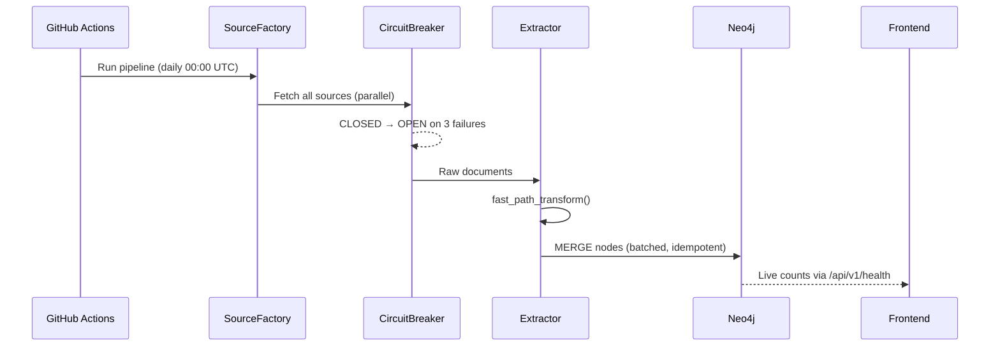
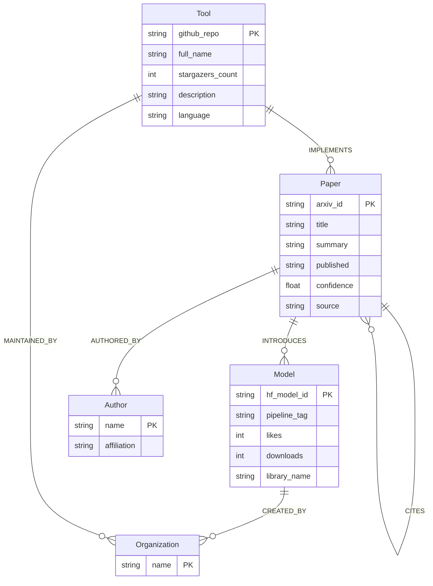
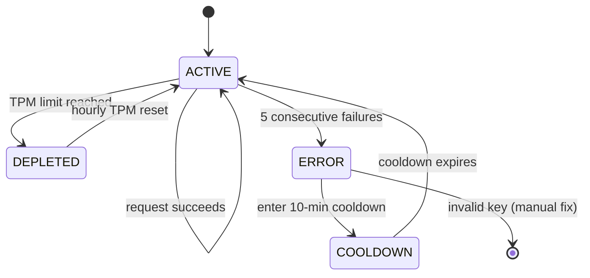
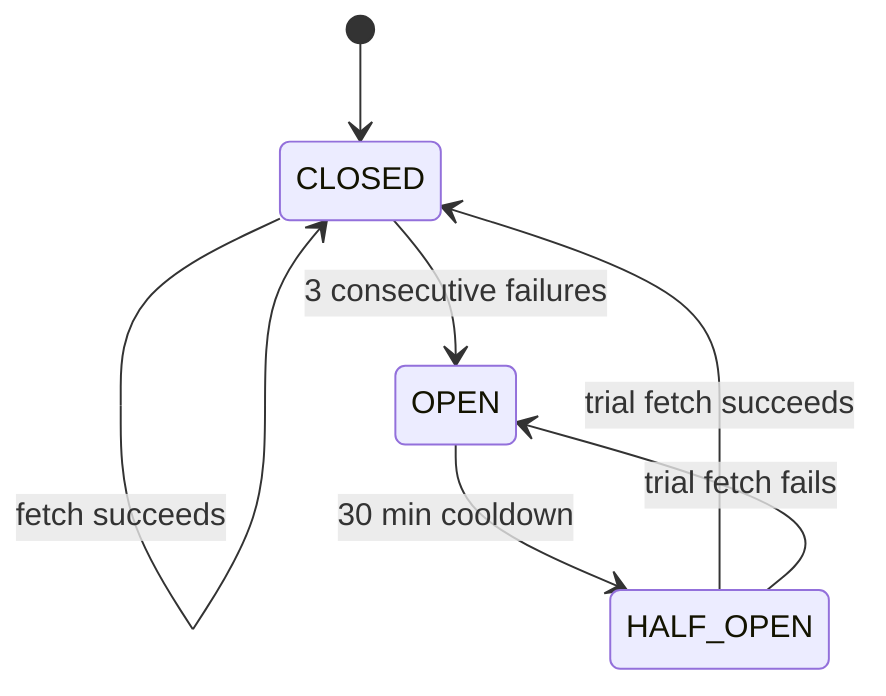

# SYNAPSE

**Systematic, Networked, Yet Natural, Automated, Provenance-aware Schema Engine**

A live, open-access AI knowledge graph. Every relationship carries its source, confidence score, and evidence snippet — updated daily from free-tier APIs. No login required.

### Why SYNAPSE

Every other AI tracker is a flat feed or list. SYNAPSE stores relationships between entities in a queryable graph — and every relationship has a birth certificate: extraction method, source URL, evidence snippet, confidence score, and verification status. The graph ages honestly: stale edges get lower confidence scores. The NL-to-Cypher pipeline has 5 layers of safety. The architecture is domain-agnostic — swap the YAML config pack and the entire system redeploys for aerospace, biotech, or any domain.

---

## Architecture

```mermaid
%%{init: {'theme': 'base', 'themeVariables': {'primaryColor': '#e0e7ff', 'primaryTextColor': '#1e1b4b', 'primaryBorderColor': '#6366f1', 'lineColor': '#6366f1', 'secondaryColor': '#f0fdf4', 'tertiaryColor': '#f0f9ff', 'background': '#ffffff', 'mainBkg': '#ffffff', 'nodeBorder': '#6366f1', 'clusterBkg': '#f8fafc', 'clusterBorder': '#e2e8f0', 'titleColor': '#1e1b4b', 'edgeLabelBackground': '#ffffff'}}}%%
flowchart TD
    subgraph Sources["Data Sources (9 APIs)"]
        A1[arXiv]
        A2[HuggingFace Hub]
        A3[GitHub Search]
        A4[Semantic Scholar]
        A5[Papers With Code]
        A6[DAIR.AI]
        A7[OpenAlex]
        A8[HF Daily Papers]
        A9[Kaggle]
    end

    subgraph Pipeline["Ingestion Pipeline"]
        B1[Generic Source Fetcher]
        B2[Circuit Breaker]
        B3[Fast-Path Extraction]
        B4[Neo4j MERGE Writer]
    end

    subgraph Storage["Storage Layer"]
        C1[(Neo4j Aura)]
        C2[(Qdrant Cloud)]
        C3[(PostgreSQL)]
    end

    subgraph API["API Layer — FastAPI"]
        D1["GET /health"]
        D2["GET /search"]
        D3["POST /query"]
        D4["GET /export"]
    end

    subgraph Frontend["Frontend — React 19"]
        E1[Dashboard]
        E2[Search]
        E3[Ask SYNAPSE]
        E4[Graph Explorer]
    end

    Sources --> B1
    B1 --> B2
    B2 --> B3
    B3 --> B4
    B4 --> C1
    B4 --> C2
    B4 --> C3
    C1 --> API
    C2 --> API
    API --> Frontend

    classDef sourceNode fill:#e0e7ff,stroke:#6366f1,color:#3730a3
    classDef pipeNode fill:#f0fdf4,stroke:#22c55e,color:#15803d
    classDef storeNode fill:#f0f9ff,stroke:#0ea5e9,color:#0369a1
    classDef apiNode fill:#faf5ff,stroke:#a855f7,color:#7e22ce
    classDef feNode fill:#fff1f2,stroke:#f43f5e,color:#be123c

    class A1,A2,A3,A4,A5,A6,A7,A8,A9 sourceNode
    class B1,B2,B3,B4 pipeNode
    class C1,C2,C3 storeNode
    class D1,D2,D3,D4 apiNode
    class E1,E2,E3,E4 feNode
```



---

## Data Flow



---

## Node Schema



---

## Groq Key Rotation



---

## Circuit Breaker



---

## Quick Start

### Prerequisites

- Python 3.12+ with [uv](https://docs.astral.sh/uv/)
- Node.js 18+
- [Neo4j Aura Free](https://neo4j.com/cloud/aura-free/) account
- [Groq API key](https://console.groq.com/) (free tier)

### Setup

```bash
# 1. Clone
git clone https://github.com/your-org/synapse.git
cd synapse

# 2. Configure environment
cp .env.example .env
# Fill in: NEO4J_URI, NEO4J_USERNAME, NEO4J_PASSWORD, GROQ_API_KEYS

# 3. Install dependencies
uv sync

# 4. Fix WSL DNS (WSL only — run once per WSL restart)
sudo bash -c "echo 'nameserver 8.8.8.8' > /mnt/wsl/resolv.conf"

# 5. Initialize Neo4j schema
uv run python -m schema.setup

# 6. Run ingestion pipeline (seeds the graph)
uv run python -m ingestion.pipeline.run --domain ai

# Terminal 1 — Backend
uv run uvicorn api.main:app --host 0.0.0.0 --port 8082

# Terminal 2 — Frontend
cd frontend && npm install && npm run dev
```

### Access

| Service | URL |
|---------|-----|
| Frontend | http://localhost:5173 |
| Backend API | http://localhost:8082 |
| API Docs | http://localhost:8082/docs |
| Health | http://localhost:8082/api/v1/health |

---

## Environment Variables

### Required

```bash
# Neo4j Aura
NEO4J_URI=neo4j+s://xxxxxxxx.databases.neo4j.io
NEO4J_USERNAME=neo4j
NEO4J_PASSWORD=your-password
NEO4J_DATABASE=neo4j

# Groq — comma-separated for multi-key rotation
GROQ_API_KEYS=gsk_key1,gsk_key2,gsk_key3
```

### Optional

```bash
GITHUB_TOKEN=ghp_xxx          # Raises GitHub rate limit 60 → 5000 req/hr
POSTGRES_URL=postgresql://... # Persistent checkpointing (Neon.dev free)
QDRANT_URL=https://...        # Vector search (Qdrant Cloud free)
QDRANT_API_KEY=xxx
GEMINI_API_KEY=xxx            # Multimodal PDF extraction
LOG_LEVEL=INFO
CORS_ORIGINS=http://localhost:5173
```

---

## Running the Pipeline

```bash
# All sources
uv run python -m ingestion.pipeline.run --domain ai

# Specific sources only
uv run python -m ingestion.pipeline.run --domain ai --sources huggingface_trending_models,github_repo_content

# Available sources
# arxiv, huggingface_daily_papers, huggingface_trending_models,
# huggingface_hub, papers_with_code, github_trending,
# github_repo_content, semantic_scholar, dair_ai_ml_papers
```

---

## Adding a New Data Source

No Python code required. Add an entry to `domains/ai/sources.yaml`:

```yaml
- name: my_source
  type: rest_json          # rest_json | rest_xml | rss | github_rss
  base_url: https://api.example.com/papers
  auth_required: false
  entity_coverage:
    - Paper
    - Author
  fetch_params:
    limit: 100
    sort: created_at
```

Or use the interactive AI-powered generator:

```bash
uv run python scripts/source_config_generator.py
```

---

## API Reference

All endpoints are open access — no authentication required.

| Method | Endpoint | Description |
|--------|----------|-------------|
| `GET` | `/api/v1/health` | Live node/edge counts + system status |
| `GET` | `/api/v1/search?q=&type=&cursor=` | Full-text search with cursor pagination |
| `POST` | `/api/v1/query` | Natural language → Cypher |
| `GET` | `/api/v1/similar?id=&k=5` | Semantic similarity via Qdrant |
| `GET` | `/api/v1/export?query=&format=` | Export as JSON-LD / CSV / GraphML |
| `GET` | `/api/v1/whats-new?days=1` | New entities in last N days |
| `GET` | `/api/v1/diff?from=&to=` | Temporal diff between two dates |
| `GET` | `/api/v1/leaderboard?type=tools` | Top tools / papers / techniques |
| `GET` | `/api/v1/groq/status` | Groq key rotation status |

### Example

```bash
# Natural language query
curl -X POST http://localhost:8082/api/v1/query \
  -H "Content-Type: application/json" \
  -d '{"natural_query": "Show me the most starred AI tools"}'

# Search
curl "http://localhost:8082/api/v1/search?q=transformers&type=Tool"

# Health (returns live Neo4j counts)
curl http://localhost:8082/api/v1/health
```

## Evaluation Metrics

| Metric | Target |
|--------|--------|
| precision@5 (T1/T2) | > 0.85 |
| recall@20 | > 0.75 |
| edge correctness (IMPLEMENTS) | > 0.80 |
| citation accuracy (CITES) | > 0.90 |
| freshness lag | < 30 hours |
| NL hallucination rate | < 0.05 |
| semantic recall | > 0.80 |
| export correctness | 100% |
| circuit recovery rate | > 0.90 |

---

## Frontend Pages

| Route | Page | Description |
|-------|------|-------------|
| `/` | Dashboard | Live stats, animated counters, source ticker |
| `/search` | Search | Full-text + vector search with filters |
| `/ask` | Ask SYNAPSE | Natural language query interface |
| `/graph` | Graph Explorer | Sigma.js WebGL interactive graph |
| `/diff` | What Changed | Temporal diff between two dates |
| `/leaderboard` | Leaderboards | Top tools, papers, techniques |
| `/quality` | Quality | System health and eval metrics |
| `/export` | Export | Download subgraph as JSON-LD / CSV / GraphML |
| `/about` | About | Architecture, stack, credits |

---

## Tech Stack

### Backend
| Component | Technology |
|-----------|-----------|
| API framework | FastAPI 0.115+ |
| Graph database | Neo4j Aura Free (200K nodes) |
| Vector search | Qdrant Cloud (1M vectors, 384-dim) |
| LLM inference | Groq Llama 4 Scout (30K TPM) |
| Checkpointing | PostgreSQL via asyncpg |
| Package manager | uv |

### Frontend
| Component | Technology |
|-----------|-----------|
| Framework | React 19 + TypeScript |
| Build tool | Vite 6 |
| Styling | TailwindCSS 3 |
| Graph viz | Sigma.js v3 (WebGL) |
| Data fetching | TanStack Query v5 |
| Animations | IntersectionObserver + CSS keyframes |

---

## Evolution (NEXUS v2.0 → SYNAPSE v3.0)

| Component | v2.0 (NEXUS) | v3.0 (SYNAPSE) |
|-----------|--------------|----------------|
| **Checkpointing** | SQLite (ephemeral) | PostgreSQL via Neon.dev (persistent) |
| **Vector Search** | None | Qdrant Cloud (1M vectors, 384-dim) |
| **Embedding** | Unspecified | all-MiniLM-L6-v2 (384-dim) |
| **UI** | Gradio | React 19 + Vite + TailwindCSS |
| **Multi-agent** | CrewAI Flows | LangGraph native |
| **Primary LLM** | Llama 3.1 8B (6K TPM) | Llama 4 Scout 17B (30K TPM) |
| **API** | Unversioned | `/api/v1/` with CORS + rate limiting |
| **Webhooks** | None | HMAC-signed push notifications |
| **Fault Tolerance** | None | Per-source circuit breakers |
| **Data Sources** | 9 | 11 (added OpenAlex, Kaggle) |
| **Source System** | 11 individual fetcher files | 1 universal fetcher + YAML config |

## Design Patterns

| Pattern | Applied To | Benefit |
|---------|-----------|---------|
| **Singleton** | Neo4j driver, Qdrant client, Groq client | Single connection pool across all pipeline stages |
| **Repository** | Source fetchers (abstract base class) | Each source independently testable and swappable |
| **Strategy** | Entity extraction (LLM, regex, code-parse) | Method swapped without touching orchestration |
| **Factory** | Domain pack loading | Plug-in architecture; new domains without core changes |
| **Circuit Breaker** | Per-source fetchers | CLOSED → OPEN (3 failures) → HALF-OPEN (30min) — auto-recovery |
| **Observer** | Pipeline stages (event bus) | Stages decoupled; new stages added without modifying existing |
| **Command** | Review queue actions (execute + rollback) | Every admin action reversible and auditable |
| **Decorator** | LLM rate limiting | `@rate_limited(rpm=30)` transparent to calling code |
| **Facade** | External SDK (SynapseClient) | Clean interface for external developers |

## GitHub Actions

Three automated workflows run on schedule:

```mermaid
gantt
    title Weekly Automation Schedule (UTC)
    dateFormat HH:mm
    axisFormat %H:%M

    section Daily
    Ingestion Pipeline   : 00:00, 45m

    section Weekly (Sunday)
    Archive              : 01:00, 30m
    Eval + Tests         : 02:00, 30m
```



Workflows use repository secrets — set these in `Settings → Secrets → Actions`:

```
NEO4J_URI, NEO4J_USERNAME, NEO4J_PASSWORD, NEO4J_DATABASE
GROQ_API_KEYS
GITHUB_TOKEN  (auto-provided by GitHub)
```

---

## Project Structure

```
synapse/
├── api/                    # FastAPI application
│   ├── main.py             # App entry point, middleware
│   ├── middleware.py        # CORS, rate limiting, security headers
│   ├── groq_manager.py     # Multi-key rotation manager
│   └── v1/
│       ├── router.py       # All API routes
│       └── groq_status.py  # Groq monitoring endpoints
├── ingestion/              # Data pipeline
│   ├── pipeline/
│   │   ├── run.py          # Main pipeline entry point ← run this
│   │   ├── state.py        # Pipeline state dataclass
│   │   └── extraction.py   # Fast-path entity extraction
│   ├── neo4j/
│   │   ├── client.py       # Async Neo4j driver wrapper
│   │   └── writer.py       # Batched MERGE writer
│   ├── generic_source.py   # Universal source fetcher
│   ├── source_factory.py   # YAML → fetcher factory
│   ├── circuit_breaker.py  # Per-source circuit breaker
│   └── checkpoint/
│       └── postgres.py     # PostgreSQL checkpoint manager
├── schema/
│   ├── config.py           # Settings (loads .env automatically)
│   ├── models.py           # Pydantic models
│   ├── setup.py            # Neo4j schema initializer
│   └── domain_loader.py    # Domain pack loader
├── query/
│   └── nl_to_cypher.py     # NL → Cypher via Groq
├── embedding/
│   ├── generator.py        # all-MiniLM-L6-v2 embeddings
│   └── qdrant_client.py    # Qdrant vector store client
├── webhook/
│   ├── registry.py         # Subscription registry
│   └── dispatcher.py       # HMAC-signed delivery
├── domains/
│   └── ai/
│       ├── sources.yaml    # ← add new sources here
│       ├── schema.yaml     # Node/edge type definitions
│       └── aliases.jsonl   # Canonical name mappings
├── frontend/               # React 19 SPA
│   ├── src/
│   │   ├── main.tsx        # Router + app entry
│   │   ├── components/
│   │   │   ├── layout.tsx  # Nav + page wrapper
│   │   │   └── Reveal.tsx  # Scroll-triggered animation wrapper
│   │   ├── hooks/
│   │   │   └── useInView.ts # IntersectionObserver hook
│   │   ├── pages/          # One file per route
│   │   └── styles/
│   │       └── globals.css # Tailwind + custom keyframes
│   ├── index.html
│   ├── vite.config.ts
│   ├── tailwind.config.js
│   └── postcss.config.js
├── scripts/
│   ├── source_config_generator.py  # AI-powered source YAML generator
│   ├── inspect_graph.py            # Check what's in Neo4j
│   ├── test_groq.py                # Test Groq API keys
│   └── verify_fixes.py             # Run all fix verifications
├── .github/
│   └── workflows/
│       ├── daily_ingest.yml
│       ├── weekly_archive.yml
│       └── weekly_eval.yml
├── .env.example
├── pyproject.toml
└── uv.lock
```

---

## Known Limitations

- **Groq NL-to-Cypher**: Returns 403 from WSL IPs due to Cloudflare network restrictions. Works fine from cloud/VPS deployments.
- **arXiv / Semantic Scholar**: Rate-limited (429) on first run if hit too frequently. Retry after 10 minutes.
- **Neo4j free tier**: 200K nodes, 400K edges. Sufficient for ~2 years of daily ingestion.
- **No date-based "most powerful" queries**: Graph stores popularity signals (stars, likes, downloads) not benchmark scores. "Most downloaded model" works; "most powerful model" does not.

---

## License

MIT — see [LICENSE](LICENSE)

Built by **Sarvesh Bhattacharyya**, Bengaluru · May 2026
