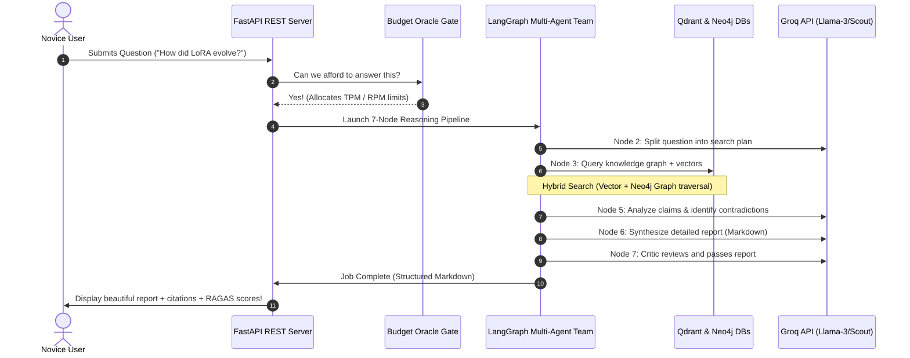
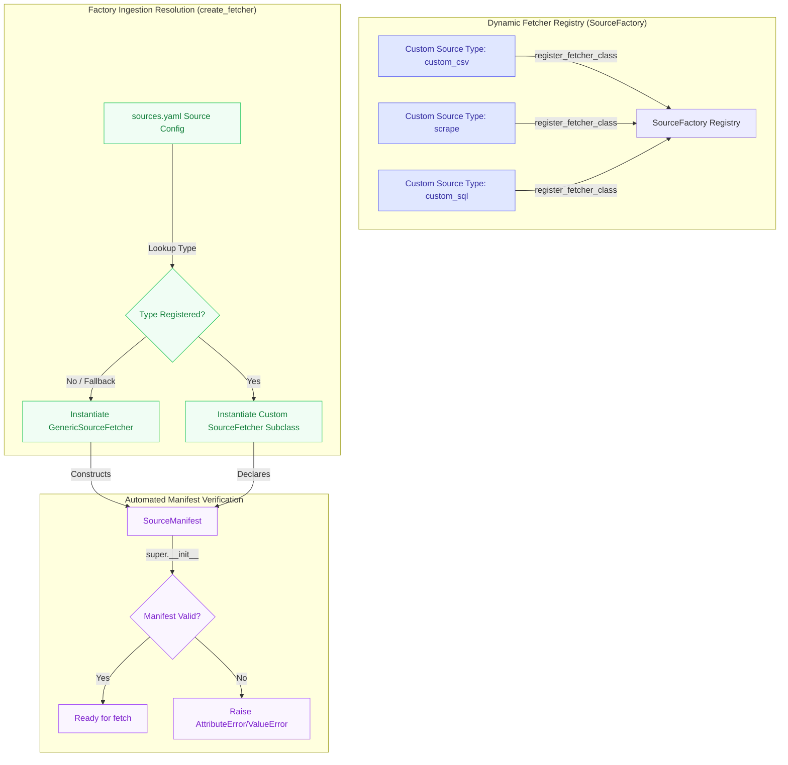

# SYNAPSE v4.0 — System Specification

> **Version:** 4.0.0 · **Author:** Sarvesh Bhattacharyya · **Updated:** May 2026

SYNAPSE (Systematic, Yet Natural, Automated, Provenance-aware Schema Engine) is an enterprise-grade live AI knowledge graph powered by a budget-aware LangGraph multi-agent reasoning team. It acts as a self-updating repository of scientific papers, tools, and models, answering complex AI ecosystem queries under strict token cost-controls.

---

## 🌟 Executive Overview: What is SYNAPSE? (For Beginners)

If you are new to the project, here is a simple breakdown of what SYNAPSE is, why it exists, and what it does:

### 1. The Problem
Developing AI systems that answer deep research questions is hard. Standard chatbots suffer from three major problems:
- **Out-of-date Information**: They don't know about papers or models released yesterday.
- **Hallucinations**: They make up facts or relationships that don't exist.
- **API Cost Inflation**: Running complex LLM tasks can cost hundreds of dollars quickly due to unchecked API consumption.

### 2. The SYNAPSE Solution
SYNAPSE is a **live, self-updating knowledge assistant** that solves all three problems:
- **It Ingests Daily**: Every day, it automatically queries 9 scientific APIs (like arXiv and HuggingFace) to retrieve new papers, tools, and models, storing them in highly efficient graph databases.
- **It Ground-Truths Answers**: When you ask a question, it queries its local database to find verified facts and relationships, ensuring the AI only answers using real, cited evidence.
- **It Enforces Strict Budgets**: Every single AI model call is gated by a "Budget Oracle" that rotates API keys and blocks execution if a query would exceed your maximum daily or per-minute token budgets.

---

## 3. High-Level User Query Flow (How It Works)

Below is the step-by-step journey of a user's question through the SYNAPSE reasoning engine:



---

## 4. Ingestion & Storage Architecture

### 4.1 Pluggable Ingestion Sources Architecture
To support the easy integration of *any* future ingestion source type (e.g., custom local CSVs, HTML crawlers, SQL databases) without modifying core files, the platform implements a pluggable factory registry:



---

## 5. Model Assignment Matrix

### Groq Free Tier (6 models, verified May 2026)

| Model | RPM | TPM | RPD | Role |
|-------|-----|-----|-----|------|
| Llama 3.1 8B | 30 | 6,000 | 14,400 | Extractor, classification, routing |
| Llama 4 Scout | 30 | 30,000 | 1,000 | Analyzer, Contradiction Detector |
| Qwen3-32B | 60 | 6,000 | 1,000 | Fallback (secondary) |
| Llama 3.3 70B | 30 | 6,000 | 1,000 | Synthesis (once/session) |
| GPT-OSS 20B | 30 | 8,000 | 1,000 | Decomposition, Critic |
| GPT-OSS 120B | 30 | 8,000 | 1,000 | Critic escalation (double-fail only) |

---

## 6. Directory Structure

```
synapse/
├── api/                        # FastAPI server (main entry point: uvicorn api.main:app)
│   ├── main.py                 # App entry — FastAPI Lifespan, CORS, router inclusion
│   ├── middleware.py            # Rate limit 120/min with active pruning, dynamic security headers
│   └── v1/
│       ├── router.py           # v3.0 endpoints (health, search, similar, etc.)
│       └── reasoning.py        # v4.0: /reason, /ingest, /budget, /eval, /webhook
│
├── budget/                     # Token Budget Controller
│   ├── oracle.py               # Budget Oracle — async singleton, DynamoDB restore, retry-safe transactions
│   ├── register.py             # Per-model RPM (60s window), RPD, TPM
│   └── scheduler.py            # Leaky Bucket Scheduler (per-model semaphores)
│
├── providers/                  # InferenceProvider Protocol
│   ├── protocol.py             # InferenceProvider, AssembledPrompt, InferenceResult
│   └── groq_provider.py        # Wraps GroqKeyManager with exponential 429 retry backoff
│
├── prompt/                     # Prompt Assembly Layer (mandatory pre-inference)
│   ├── assembler.py            # 5-layer builder + budget trimming + tiktoken
│   └── roles/                  # Static system prompts (extractor, synthesizer, etc.)
│
├── reasoning/                  # 7-node LangGraph reasoning pipeline
│   ├── graph/
│   │   ├── builder.py          # Loads YAML topology, dynamically resolves entry point & wrapping gates
│   │   └── definitions/default.yaml  # Graph topology (nodes, edges, budget gates)
│   └── nodes/
│       ├── entry.py            # Budget check, session init
│       ├── decomposition.py    # GPT-OSS 20B → sub-questions + search plan
│       ├── retrieval.py        # 4-tier hybrid retrieval using cached embedding generator
│       ├── analysis_crew.py    # Extractor + Analyzer + ContradictionDetector
│       ├── synthesis.py        # Llama 3.3 70B → structured Markdown
│       ├── critic.py           # GPT-OSS 20B → pass/fail + retry loop
│       └── output.py           # Template assembly + RAGAS evaluation
│
├── retrieval/                  # LlamaIndex data layer
│   ├── index_builder.py        # VectorStoreIndex (Qdrant) + BM25 + KGIndex fallback router
│   └── query_engines.py        # Optimized query_vector, query_bm25, query_hybrid (using shared drivers)
│
├── embedding/                  # Vector embeddings
│   ├── generator.py            # all-MiniLM-L6-v2 cached singleton (384-dim)
│   └── qdrant_client.py        # Qdrant singleton client
│
├── sync/                       # Background content acquisition
│   └── background_scraper.py   # 9-source scrape + verifiers using cached embedding generator
│
├── ingestion/                  # Data pipeline (v3.0, extended)
│   ├── sources/base.py         # SourceDocument, SourceManifest, SourceFetcher ABC validation
│   ├── generic_source.py       # Universal JSON/XML/RSS fetcher inheriting SourceFetcher
│   ├── source_factory.py       # Pluggable Factory Registry resolving custom and generic fetchers
│   ├── circuit_breaker.py      # CircuitBreaker with JSON file state persistence
│   └── neo4j/client.py         # Async Neo4j driver connection pool singleton
│
└── frontend/                   # React 19 SPA (Vite Configured Proxy + TailwindCSS 4)
    └── src/pages/
        ├── dashboard.tsx       # Animated counters, source ticker
        ├── ask.tsx             # NL query interface
        ├── reason.tsx          # Deep Reasoning — live pipeline stages + RAGAS scores
        └── budget.tsx          # Per-model token budget bars (10s refresh)
```

---

## 7. v4.0 Architectural Refactoring & Hardening Updates

After a comprehensive audit and codebase upgrade, the following critical refactoring and stability updates were implemented:

| Component | Issue | Architecture Update & Resolution |
| :--- | :--- | :--- |
| **Reasoning Engine** | Dead-code budget gates & hardcoded entry point | Active dynamic wrapping in `GraphBuilder.build()`. Dynamic budget token calculations based on query length/complexity and dynamic entry-point resolution from the topology YAML. |
| **Embedding Retrieval** | Re-instantiation latency bottleneck | Converted all query and ingestion pipelines (including `retrieval.py`, `background_scraper.py`, and `embedding_pipeline.py`) to use the cached global singleton `get_embedding_generator()`, eliminating model reload latency. |
| **Database Clients** | Neo4j client re-instantiation overhead & BM25 limit | Implemented a global cached `get_neo4j_client()` singleton driver pool and properly registered its cleanup in the new FastAPI `lifespan` handler. Optimized manual BM25 loading to selectively filter relevant nodes up to a reduced `500` node ceiling. |
| **Ingestion Pipeline** | Brittle generic source type mapping | Refactored `GenericSourceFetcher` to inherit from the `SourceFetcher` base class. Introduced a dynamic Factory Ingestion Registry enabling developers to register any custom source types (`"custom_csv"`, `"scrape"`, etc.) without modifying core codebase files. |
| **API & Routing** | Unsanitized payloads & redundant loaders | Replaced raw dictionary bodies in `/webhook/subscribe` with a structured Pydantic `WebhookSubscriptionRequest` validator. Removed redundant dot-env loading and unused settings from `api/main.py`. |
| **Providers** | Immediate failures on rate-limits (HTTP 429) | Integrated robust exponential backoff retries (`2.0 * (2 ** attempt)` up to 3 retries) on Groq rate limits for both synchronous and streaming generations. |
| **System Stability** | In-memory only circuit breakers | Persisted circuit breaker state registers to a local JSON file (`circuit_breaker_state.json`), enabling breakers memory to survive server restarts. |
| **Frontend Tooling** | Tailwind version conflict & Vite target hardcoding | Upgraded `tailwindcss` devDependencies to v4 to align with `@tailwindcss/vite`. Reconfigured `vite.config.ts` to dynamically retrieve the proxy API target via Vite's `loadEnv` from environment variables. |

---

*Built by Sarvesh Bhattacharyya, Bengaluru · May 2026*
