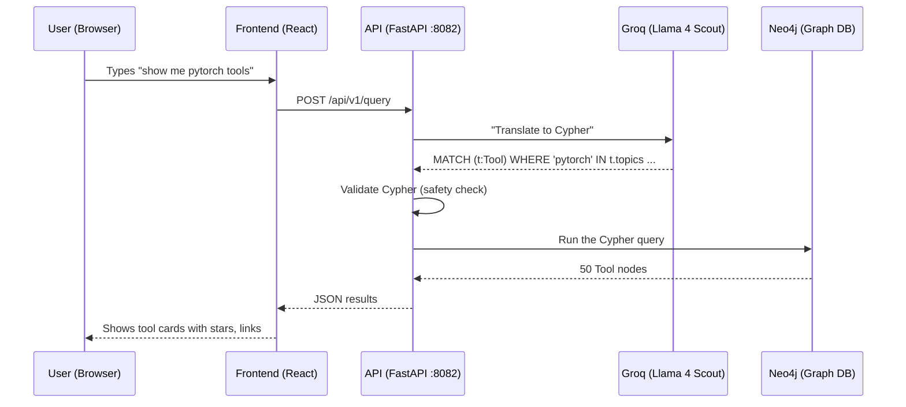
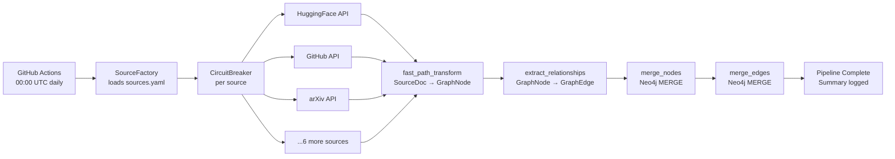
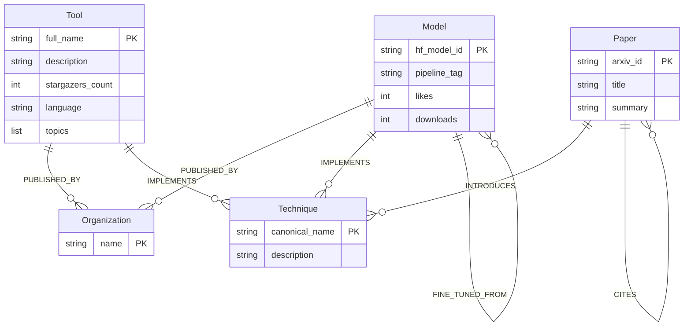
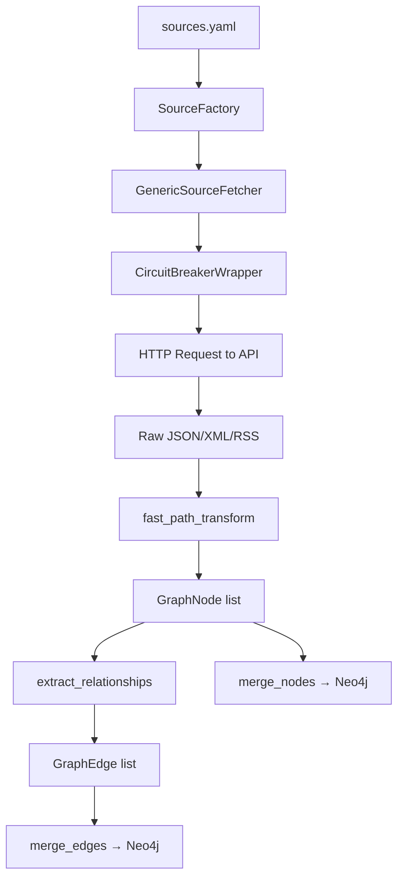
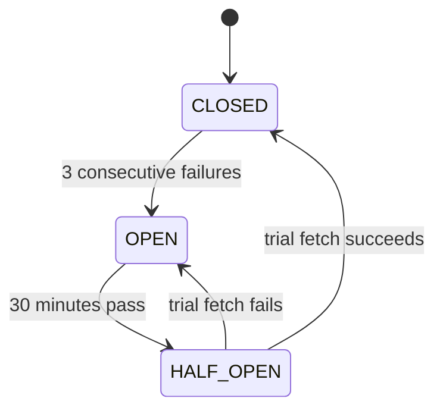

# SYNAPSE — Complete Codebase Guide

> Written for someone who is completely new to this codebase.
> Every folder, file, function, and key piece of code is explained.

---

## Part 1 — What Is SYNAPSE?

### The One-Line Answer
SYNAPSE is a **live AI knowledge graph** — a database that knows about AI papers, models, tools, and techniques, and how they all connect to each other. It updates itself every day automatically.

### Consumer Side (What a User Sees)
A user visits the website and can:
- **Ask questions in plain English** — "Show me the most starred PyTorch tools" → gets a list of real results
- **Search** — type "transformers" and see all tools, models, papers related to it
- **Explore the graph** — click on a node (e.g. "huggingface/transformers") and see everything connected to it
- **See what changed** — compare the AI landscape between two dates
- **Export data** — download a subgraph as JSON, CSV, or GraphML for their own research
- **See leaderboards** — top tools by stars, top models by downloads

### Engine Side (What Happens Behind the Scenes)
Every day at 5:30 AM IST, an automated job:
1. Fetches data from 9 free APIs (arXiv, HuggingFace, GitHub, etc.)
2. Extracts entities (papers, models, tools) from the raw data
3. Derives relationships (this tool is published by that org, this model implements that technique)
4. Writes everything into a graph database (Neo4j) — idempotently (running it twice gives the same result)
5. When a user asks a question, an AI (Llama 4 Scout via Groq) translates it to a graph query, runs it, and returns results

### The Tech Stack in Plain English
| What | Technology | Why |
|------|-----------|-----|
| Graph database | Neo4j Aura | Stores nodes (papers, tools) and edges (relationships) |
| Vector search | Qdrant Cloud | Finds semantically similar items |
| AI inference | Groq (Llama 4 Scout) | Translates English questions to graph queries |
| Backend API | FastAPI (Python) | Serves data to the frontend |
| Frontend | React 19 + Vite | The website users see |
| Styling | TailwindCSS | Makes it look good |
| Automation | GitHub Actions | Runs the daily data pipeline |
| Checkpointing | PostgreSQL (Neon.dev) | Remembers what was already processed |

---

## Part 2 — Project Structure Overview

```
synapse/
├── api/                  ← The web server (FastAPI)
├── ingestion/            ← The data pipeline (fetches + writes data)
├── schema/               ← Data models and configuration
├── query/                ← Natural language → graph query translation
├── embedding/            ← Vector embeddings (semantic search)
├── webhook/              ← Push notifications to external systems
├── export/               ← Export graph data as files
├── admin/                ← Admin tools (review queue)
├── seed/                 ← Synthetic test data generator
├── domains/ai/           ← AI-specific configuration (schema, sources, aliases)
├── scripts/              ← Developer utility scripts
├── tests/                ← Automated tests
├── frontend/             ← The React website
├── .github/workflows/    ← GitHub Actions (daily pipeline, weekly tests)
├── main.py               ← Simple startup check
├── pyproject.toml        ← Python dependencies
└── .env                  ← Your secret keys (never commit this)
```

---

## Part 3 — Architecture Diagrams

### How a User Query Works



### How the Daily Pipeline Works



### The Graph Data Model



---

## Part 4 — The `schema/` Folder

This folder defines the **data structures** used everywhere in the project. Think of it as the "blueprint" folder.

---

### `schema/config.py` — Settings

**What it does:** Reads all your environment variables (from `.env`) and makes them available to every other file in the project.

```python
class Settings(BaseModel):
    neo4j_uri: str = Field(default="bolt://localhost:7687")
    neo4j_username: str = Field(default="neo4j")
    # ... all other settings
```

Every setting has a default value. If you don't set `NEO4J_URI` in your `.env`, it falls back to `bolt://localhost:7687`.

```python
@lru_cache(maxsize=1)
def get_settings() -> Settings:
    load_dotenv()          # reads .env file
    return Settings.from_env()  # creates Settings from environment variables
```

`@lru_cache(maxsize=1)` means this function only runs **once** — the result is cached. Every time any file calls `get_settings()`, it gets the same object back without re-reading the `.env` file. This is important for performance.

**Key settings:**
- `neo4j_uri/username/password/database` — how to connect to Neo4j
- `groq_api_keys` — comma-separated list of Groq API keys (e.g. `key1,key2,key3`)
- `groq_model` — which AI model to use (default: `meta-llama/llama-4-scout-17b-16e-instruct`)
- `qdrant_url/api_key` — Qdrant vector database connection
- `postgres_url` — PostgreSQL for checkpointing
- `cors_origins` — which websites are allowed to call the API
- `synapse_admin_key` — secret key for admin operations

---

### `schema/models.py` — Data Models

**What it does:** Defines the Python objects that represent data flowing through the system.

```python
class FactTier(str, Enum):
    T1 = "T1"   # Highest trust — from official API (e.g. GitHub stars count)
    T2 = "T2"   # Medium trust — extracted from text
    T3 = "T3"   # Lower trust — inferred/derived
    T4 = "T4"   # Lowest trust
    SYSTEM = "SYSTEM"  # System-generated (e.g. aliases)
```

Every piece of data in SYNAPSE has a trust level. T1 means "we got this directly from an official source". T3 means "we guessed this from context".

```python
class GraphNode(BaseModel):
    label: str          # e.g. "Tool", "Model", "Paper"
    key: str            # the dedup field name (e.g. "full_name")
    properties: dict    # all the data (stars, description, etc.)
    source: str         # which API this came from
    confidence: float   # 0.0 to 1.0
```

A `GraphNode` is what gets written to Neo4j. It represents one entity (one tool, one model, one paper).

```python
class GraphEdge(BaseModel):
    relationship: str   # e.g. "PUBLISHED_BY", "IMPLEMENTS"
    from_label: str     # e.g. "Tool"
    from_key: str       # e.g. "huggingface/transformers"
    to_label: str       # e.g. "Organization"
    to_key: str         # e.g. "huggingface"
    fact_tier: FactTier
    provenance: ProvenanceRecord | None
```

A `GraphEdge` is a relationship between two nodes. "huggingface/transformers PUBLISHED_BY huggingface" is one edge.

```python
class ProvenanceRecord(BaseModel):
    evidence_source: str      # which API/file this came from
    evidence_url: str | None  # link to the original source
    extraction_method: str    # "field_extraction", "topic_mapping", etc.
    confidence: float         # how sure we are
    verification_status: VerificationStatus  # unverified/weak/verified/disputed
```

This is SYNAPSE's "birth certificate" for every relationship. Every edge knows where it came from.

---

### `schema/setup.py` — Database Initialization

**What it does:** Creates the Neo4j constraints and indexes when you first set up the project.

```python
async def create_schema() -> None:
    settings = get_settings()
    domain_pack = load_domain_pack(settings.default_domain)  # loads domains/ai/
    client = Neo4jClient.from_settings(settings)
    async with client.session() as session:
        for statement in _node_constraints(domain_pack.schema):
            await session.run(statement)
```

It reads `domains/ai/schema.yaml`, generates `CREATE CONSTRAINT` and `CREATE INDEX` Cypher statements, and runs them against Neo4j. You only need to run this once when setting up a new database.

**Run it with:** `uv run python -m schema.setup`

---

### `schema/domain_loader.py` — Domain Pack Loader

**What it does:** Loads the AI domain configuration files into a Python object.

```python
def load_domain_pack(name: str) -> DomainPack:
    base_root = Path(__file__).parent.parent / "domains" / name
    schema  = yaml.safe_load((base_root / "schema.yaml").read_text())
    sources = yaml.safe_load((base_root / "sources.yaml").read_text())
    aliases = [json.loads(line) for line in (base_root / "aliases.jsonl").read_text().splitlines()]
    return DomainPack(name=name, root=base_root, schema=schema, sources=sources, aliases=aliases)
```

When you call `load_domain_pack("ai")`, it reads three files from `domains/ai/`:
- `schema.yaml` — what node types and relationship types exist
- `sources.yaml` — which APIs to fetch from
- `aliases.jsonl` — alternative names for techniques (e.g. "LoRA" = "Low-Rank Adaptation")

---

## Part 5 — The `domains/ai/` Folder

This folder contains all the **AI-specific configuration**. SYNAPSE is designed to be domain-agnostic — you could create a `domains/space/` or `domains/bio/` folder and the entire engine would work for those domains too.

---

### `domains/ai/schema.yaml` — The Graph Schema

**What it does:** Defines every node type and relationship type that can exist in the graph.

Example node definition:
```yaml
Tool:
  properties:
    github_repo: {type: string, required: true, indexed: true}
    github_stars: {type: integer, default: 0}
    description: {type: string}
    language: {type: string}
  dedup_key: github_repo   # ← this field must be unique; used for MERGE
```

The `dedup_key` is critical — it's the field Neo4j uses to decide "is this the same tool I already have?" If you ingest `pytorch/pytorch` twice, Neo4j updates the existing node instead of creating a duplicate.

Example relationship definition:
```yaml
IMPLEMENTS:
  from: [Tool, Model]
  to: Technique
  provenance: true      # ← this edge carries a ProvenanceRecord
  trust_level: T2
```

---

### `domains/ai/sources.yaml` — Data Sources Configuration

**What it does:** Tells the pipeline which APIs to fetch from and how.

```yaml
- name: github_repo_content
  type: rest_json
  base_url: https://api.github.com/search/repositories
  auth_required: optional
  auth_env_var: GITHUB_TOKEN      # ← uses your GitHub token if available
  entity_coverage:
    - Tool
  fetch_params:
    q: "topic:machine-learning topic:deep-learning language:python stars:>100"
    sort: stars
    per_page: 50
```

Each source entry tells the `GenericSourceFetcher` exactly:
- Where to fetch from (`base_url`)
- What format the response is in (`type`: rest_json, rest_xml, rss)
- What entities to expect (`entity_coverage`)
- What parameters to send (`fetch_params`)
- Whether authentication is needed (`auth_env_var`)

**Current sources:**
1. `arxiv` — AI research papers
2. `huggingface_daily_papers` — HF's curated daily papers RSS
3. `huggingface_trending_models` — Top models by likes
4. `huggingface_hub` — Top models by downloads
5. `papers_with_code` — Papers with code implementations
6. `github_trending` — Trending Python repos
7. `github_repo_content` — ML repos by topic search
8. `semantic_scholar` — Academic paper search
9. `dair_ai_ml_papers` — DAIR.AI weekly curated papers

---

### `domains/ai/aliases.jsonl` — Technique Name Aliases

**What it does:** Maps alternative names to canonical technique names.

Each line is a JSON object:
```json
{"alias": "LoRA", "canonical": "Low-Rank Adaptation", "source": "community"}
{"alias": "RAG", "canonical": "Retrieval-Augmented Generation", "source": "community"}
{"alias": "RLHF", "canonical": "Reinforcement Learning from Human Feedback", "source": "community"}
```

This ensures that if one paper calls it "LoRA" and another calls it "Low-Rank Adaptation", they both point to the same `Technique` node in the graph.

---

### `domains/ai/ranking.py` — Result Ranking

**What it does:** Computes a relevance score for search results.

```python
def compute_rank(node: dict, query_context: dict) -> float:
    relevance   = query_context.get("text_match_score", 0.5) * 0.45
    verification = {"verified": 1.0, "weak": 0.6, "unverified": 0.3}.get(
        node.get("verification_status", "unverified"), 0.3) * 0.25
    freshness   = _freshness_score(node.get("last_seen")) * 0.15
    popularity  = _popularity_score(node) * 0.15
    return relevance + verification + freshness + popularity
```

The score is a weighted combination:
- **45%** — how well it matches the search query
- **25%** — how verified the data is (T1 > T2 > T3)
- **15%** — how recently it was updated
- **15%** — how popular it is (stars, downloads, likes)

---

### `domains/ai/prompts.py` — LLM Prompts

**What it does:** Contains the prompt templates used when asking Groq to extract entities from raw text.

These prompts tell the AI: "Here is a paper abstract. Extract the techniques mentioned, the models introduced, and the organizations involved."

---

### `domains/ai/templates.py` — Safe Cypher Templates

**What it does:** Pre-written Cypher query templates for common questions.

Instead of always generating Cypher from scratch with an LLM, some common queries are hardcoded here as safe templates. For example, "what's new today" always runs the same Cypher — no need to ask the AI.

---

## Part 6 — The `ingestion/` Folder

This is the **heart of SYNAPSE**. It fetches data from the internet and writes it into Neo4j.



---

### `ingestion/sources/base.py` — Base Classes

**What it does:** Defines the fundamental data structures for the ingestion system.

```python
@dataclass
class SourceDocument:
    source_name: str    # e.g. "github_repo_content"
    external_id: str    # e.g. "pytorch/pytorch"
    entity_type: str    # e.g. "Tool"
    payload: dict       # the raw data from the API
    raw_text: str = ""
    evidence_url: str = ""
```

A `SourceDocument` is the raw data from one API call — one paper, one model, one tool. It hasn't been processed yet.

```python
class SourceFetcher(ABC):
    @abstractmethod
    async def fetch(self) -> list[SourceDocument]: ...
```

`SourceFetcher` is an abstract base class — it defines the interface that every fetcher must implement. Every fetcher must have a `fetch()` method that returns a list of `SourceDocument` objects.

---

### `ingestion/generic_source.py` — The Universal Fetcher

**What it does:** One class that can fetch from ANY source type (JSON API, XML API, RSS feed) based on configuration.

```python
@dataclass
class SourceConfig:
    name: str
    base_url: str
    entity_coverage: List[str]
    type: str = "rest_json"      # rest_json | rest_xml | rss | github_rss
    auth_required: bool = False
    auth_env_var: Optional[str] = None
    fetch_params: Dict[str, Any] = field(default_factory=dict)
```

```python
class GenericSourceFetcher:
    def __init__(self, config):
        # If auth_env_var is set, add Authorization header automatically
        import os
        headers = dict(self.config.headers or {})
        if self.config.auth_env_var:
            token = os.environ.get(self.config.auth_env_var, "")
            if token:
                headers["Authorization"] = f"token {token}"

        self.client = httpx.AsyncClient(
            headers=headers,
            timeout=30.0,
            follow_redirects=True,  # important: arXiv redirects HTTP→HTTPS
        )
```

The `__init__` method automatically injects the GitHub token (or any other auth token) into the HTTP headers if the source requires it.

```python
async def _fetch_with_backoff(self) -> List[SourceDocument]:
    source_type = self.config.type
    if source_type == "rest_json":
        return await self._fetch_rest_json()
    elif source_type == "rest_xml":
        return await self._fetch_rest_xml()
    elif source_type in ("rss", "rss_xml", "github_rss"):
        return await self._fetch_rss()
```

Based on the `type` field in `sources.yaml`, it dispatches to the right fetch method.

**How it determines entity type from raw data:**
```python
def _determine_entity_type(self, item: Dict) -> Optional[str]:
    if "arxiv_id" in item or "paperId" in item:
        return "Paper"
    if "hf_model_id" in item or "modelId" in item:
        return "Model"
    if "github_repo" in item or "repository" in item:
        return "Tool"
    # fallback: use first item in entity_coverage list
    return self.config.entity_coverage[0] if self.config.entity_coverage else "Paper"
```

---

### `ingestion/source_factory.py` — Source Factory

**What it does:** Reads `sources.yaml` and creates `GenericSourceFetcher` instances for each source.

```python
class SourceFactory:
    def __init__(self, config_path=None):
        # Default: loads domains/ai/sources.yaml
        self.sources_config = self._load_sources_config()
        self.active_fetchers = {}

    def create_fetcher(self, source_name: str) -> GenericSourceFetcher:
        source_config = self._get_source_config(source_name)
        return GenericSourceFetcher(source_config)

    def create_all_fetchers(self) -> Dict[str, GenericSourceFetcher]:
        return {name: self.create_fetcher(name) for name in self.get_all_source_names()}
```

Think of `SourceFactory` as a factory that produces fetchers on demand. You say "give me a fetcher for arxiv" and it reads the arxiv config from YAML and creates the right fetcher.

---

### `ingestion/circuit_breaker.py` — Circuit Breaker

**What it does:** Prevents the pipeline from hammering a broken API forever.



```python
class CircuitBreaker:
    def can_attempt(self) -> bool:
        if self.state == CircuitState.CLOSED:
            return True
        if self.state == CircuitState.OPEN:
            # Check if 30 minutes have passed
            if datetime.now() - self.last_failure_time > self.timeout:
                self.state = CircuitState.HALF_OPEN
                return True  # allow one trial
            return False     # still blocked
        return True  # HALF_OPEN: allow one trial

    def record_failure(self):
        self.failure_count += 1
        self.last_failure_time = datetime.now()
        if self.failure_count >= self.failure_threshold:  # 3 failures
            self.state = CircuitState.OPEN
```

**Why this matters:** If arXiv is down, without a circuit breaker the pipeline would try to fetch from arXiv 100 times, wasting time and potentially getting your IP banned. With the circuit breaker, after 3 failures it stops trying for 30 minutes, then tries once more.

---

### `ingestion/circuit_breaker_wrapper.py` — Circuit Breaker Wrapper

**What it does:** Wraps any fetcher with circuit breaker protection AND exponential backoff retry.

```python
class CircuitBreakerWrapper:
    async def fetch(self) -> List[SourceDocument]:
        if not self.circuit_breaker.can_attempt():
            logger.warning(f"Circuit breaker OPEN for {self.source_name}, skipping")
            return []  # return empty, don't crash the pipeline

        try:
            result = await self._fetch_with_backoff()
            self.circuit_breaker.record_success()
            return result
        except Exception as e:
            self.circuit_breaker.record_failure()
            return []  # return empty, don't crash the pipeline
```

```python
async def _fetch_with_backoff(self, max_retries=3):
    base_delay = 1.0
    for attempt in range(max_retries + 1):
        try:
            return await self.fetcher.fetch()
        except Exception as e:
            if attempt == max_retries:
                raise
            delay = base_delay * (2 ** attempt)  # 1s, 2s, 4s
            await asyncio.sleep(delay)
```

Exponential backoff means: wait 1 second, then 2 seconds, then 4 seconds between retries. This is polite to APIs that are temporarily overloaded.

---

## Part 7 — Design Patterns (Why the Architecture Looks This Way)

These patterns are enforced as architectural contracts — not optional suggestions. Understanding them explains why each module is structured the way it is.

### Singleton — Neo4j driver, Qdrant client, Groq client

Module-level instances checked at import time. Prevents connection storms on startup — there is exactly one connection pool shared across all pipeline stages.

### Repository — Source fetchers

Each data source implements an abstract `BaseSource` class with `fetch()` and `validate()` contracts. This makes every source independently testable, swappable, and mockable without touching any other code.

### Strategy — Entity extraction methods

The extraction system uses an `ExtractionStrategy` abstract base class. LLM-based extraction, regex-based extraction, and code-parsing extraction are all interchangeable strategies selected per source type at runtime. You can swap GPT for Claude or add a new extraction method without changing orchestration logic.

### Factory — Domain pack loading

`DomainPackFactory.load(domain_name)` returns a typed `DomainPack` object. New domains are registered without core changes — this is the plug-in architecture that makes SYNAPSE domain-agnostic.

### Circuit Breaker — Per-source fetchers

Each source is wrapped in a state machine: CLOSED (normal) → OPEN (after 3 consecutive failures, 30-min timeout) → HALF-OPEN (one trial fetch). Prevents cascading failures when one API goes down, and auto-recovers when it comes back.

### Observer / Event Bus — Pipeline stages

Pipeline stages communicate through an internal event bus. Stages publish events (e.g., "extraction complete") and subscribe to events they care about. New stages can be added without modifying existing ones.

### Command — Review queue actions

Every admin action in the review queue (accept edge, reject edge, merge nodes) is a Command object with `execute()` and `rollback()` methods. Every action is reversible and stored as an audit log.

### Decorator — LLM rate limiting

`@rate_limited(rpm=30)` decorator is applied once to LLM client methods. Rate limiting is transparent to calling code — the decorator handles throttling, backoff, and TPM tracking.

### Facade — External SDK

`SynapseClient` wraps all API endpoints with typed return types. External developers get a clean, stable interface while the internal API can change freely behind the facade.
